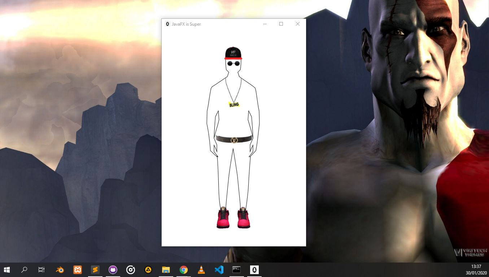

# person_in_javaFX
DESCRIPTION

This is a simple program with a drawing of person on a canvas using JavaFX

#How to run

**Ensure You have set JAVA_HOME system variable in your path.** 
Follow this link to set that up: *https://docs.oracle.com/goldengate/1212/gg-winux/GDRAD/java.htm*

1. Clone the repository to your prefered location on your computer
2. Launch CMD and Run cd "/path_to_project_location/person_in_javafx/"
3. Compile the program by running *javac Person.java* command in CMD
4. Run the program by running *Person*

#Screenshot

